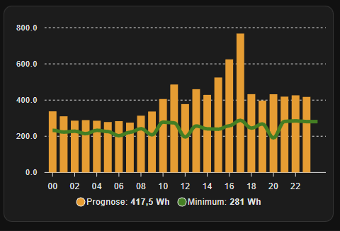

# Power Usage forecast

This is a helper sensor for home assistant that can make a power usage forecast base on historical power usage.

You can choose between average or median. Median will typically always be the best option because it will remove extreme periods.

If you have enough data in the past, the forecast will be based on same week days. So if today is a Monday, you will get averages/median for the hours from past mondays. If there is not enough data, the calculation will fallback to just using the last x days.

## Why?

The power usage forecast can be used together with a solar power forecast to make a battery level forecast


## Installation

Use [hacs](https://www.hacs.xyz/) or copy the files in custom_components/power_usage_forecast manually yourself

You need to add this git repository as as custom repository in hacs

## Adding the usage forecast sensor

* In home assistant goto Settings|Devices&Services| Helpers
* Click the "+Create Helper" button.
* Find the "Power Usage Forecast"
* Give the sensor a name, and select the energy sensor you want to use for the forecast.

The energy sensor should be an accumulating sensor, if you only have the current power usage, you can make an accumulating sensor using the "integral" sensor.
(Look at the config/configuration.yaml file for an example - this is for testing, simulating a random usage. Note an integral sensor can also be created using the UI in home assistant)

## Sensor state

The sensor state will be the estimated total usage of energy for 24h the current day

## Sensor attributes

The sensor has these attributes for the forecast values

```yaml
days: number of days included in the forecast
method: Average|Median
max_forecast: max energy usage for 1 period
min_forecast: min energy usage for 1 period
max_1day: max 1 day energy usage
min_1day: min 1 day energy usage
forecast:
  - time: period start time
    wh: energy forecast in this period
    max: max energy in this period
    min: min energy in this period
  - time: next period start time
  ...
```

## Apex charts example

This is an example of an apex chart showing 24h forecast



The yellow bars are the forecast, the green graph is the minimum usage.

```yaml
type: custom:apexcharts-card
graph_span: 24h
span:
  start: day
apex_config:
  xaxis:
    type: datetime
    labels:
      datetimeFormatter:
        hour: HH
series:
  - entity: sensor.forbrugsprognose
    name: Prognose
    type: column
    data_generator: |
      return entity.attributes.forecast.map((value, index) => {
        const timestamp = new Date(value.time);
        return [timestamp.getTime(), value.wh];
      });
  - entity: sensor.forbrugsprognose
    name: Minimum
    type: line
    color: green
    data_generator: |
      return entity.attributes.forecast.map((value, index) => {
        const timestamp = new Date(value.time);
        return [timestamp.getTime(), value.min];
      });

```
